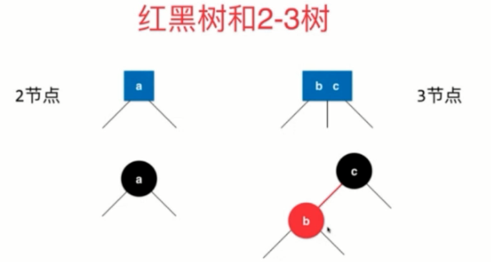

<!-- GFM-TOC -->
* [红黑树](#红黑树)
    * [什么是红黑树](#什么是红黑树)
    * [红黑树和2-3树](#红黑树和2-3树)
    * [红黑树性质](#红黑树性质)
    * [红黑树中添加新元素](#红黑树中添加新元素)
<!-- GFM-TOC -->

# 红黑树
## 什么是红黑树
### 2-3树
- 2-3树性质：

1.满足二叉搜索树的基本性质

2.节点可以存放一个或者两个元素

3.2-3树是一棵绝对平衡的树(从根节点到叶子节点所经过的节点数都相同)

- 下图是一棵完整的2-3树：

### 2-3树是如何维持绝对平衡的
- 向2-节点中插入数据

- 向3-节点中插入数据

- 向3-节点中插入数据,并且该3-节点父节点是2-节点

- 向3-节点中插入数据,并且该3-节点父节点也是3-节点

## 红黑树和2-3树
- 2-3树中2-节点等同于红黑树中的“黑”节点，红黑树中的“红”节点+红边+“黑”节点就等同于2-3树中的3-节点

基于红黑树和2-3树的关系，我们可以将2-3树转化为红黑树：

即

## 红黑树性质
1.每个节点或者是红色的，或者是黑色的

2.根节点是黑色的

3.每一个叶子节点(最后的空节点)是黑色的

4.如果一个节点是红色的，那么它们的孩子节点都是黑色的

5.从任意一个节点到叶子节点，锁经过的黑色节点都是一样的

