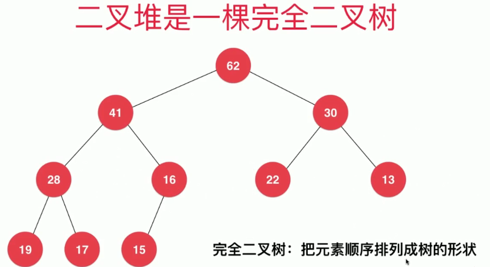
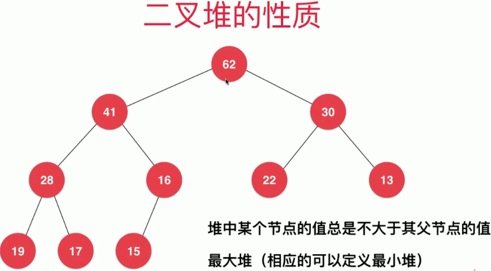
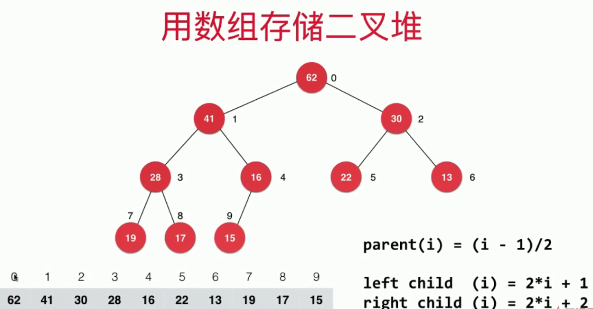

<!-- GFM-TOC -->
* [优先队列和堆](#优先队列和堆)

<!-- GFM-TOC -->

# 优先队列和堆

| 底层结构 | 入队 | 出队（获取最大元素） |
| :---: | :---: | :---: |
| 普通线性结构 | O(1) | O(n) |
| 顺序线性结构 | O(n) | O(1) |
| 堆 | O(log n)| O(log n) |


## 二叉堆的性质

* 二叉堆是一棵完全二叉树
<div align="center"></div>

* 堆中的某个结点值总是不大于其父节点的值
<div align="center"></div>

## 堆的基础表示

* 使用数组存储二叉堆，下标从1开始

<div align="center"></div>

* 使用数组存储二叉堆，下标从0开始

<div align="center"></div>

白板编程最大堆的一些准备工作：
```java
public class MaxHeap<E extends Comparable<E>> {
    private E[] data;
    private int size;
    //记录堆中元素个数

    public MaxHeap(int capacity){
        data=(E[])new Comparable[capacity];
    }

    public MaxHeap(){
        this(10);
    }

    //返回堆中元素个数
    public int size(){
        return size;
    }

    //判断堆是否为空
    public boolean isEmpty(){
        return size==0;
    }

    //返回一个索引的父节点的索引
    private int parent(int index){
        if(index==0){
            throw new IllegalArgumentException("index-0 does not have parment");
        }
        return (index-1)/2;
    }

    //返回一个索引的左孩子节点的索引
    private int leftChild(int index){
        return 2*index+1;
    }

    //返回一个索引的左孩子节点的索引
    private int rightChild(int index){
        return 2*index+2;
    }
    
    private void swap(int i,int j){
            if(i<0 || i>=size || j<0 || j>=size){
                throw new IllegalArgumentException("Index is illegal");
            }
            E tmp=data[i];
            data[i]=data[j];
            data[j]=tmp;
    }
}
```

## 先堆中添加元素和取出元素
* 向堆中添加元素和上浮操作

```java
//向堆中添加元素
//时间复杂度 O(log n)
public void add(E e){
    if(size==data.length){
        throw new IllegalArgumentException("MaxHeap is full");
    }
    data[size]=e;
    size++;
    swim(size-1);
}

//对索引为k的元素，进行上浮操作，得到一个新的最大堆
private void swim(int k){
    //k==0，就不需要上浮了
    while(k>0 && data[k].compareTo(data[parent(k)])>0){
        //data[k].compareTo(data[parent(k)])>0 k索引对应的值大于k的父索引对应的值，交换二者数值
        swap(k,parent(k));
        k=parent(k);
    }
}
```
* 向堆中取出元素和下沉操作
```java
//从堆中取出元素
//时间复杂度O(log n)
public E extractMax(){
    if(size==0){
        throw new IllegalArgumentException("MaxHeap is empty");
    }
    E ret=data[size-1];
    swap(0,size-1);
    sink(0);
    size--;
    return ret;
}

private void sink(int k){
    while(leftChild(k)<size){
        //j表示的是k的左右孩子中值较大的元素的下标
        int j=leftChild(k);
        if(j+1<size && data[j].compareTo(data[j+1])<0){
            j=rightChild(k);
        }
        if(data[k].compareTo(data[j])>=0){
            break;
        }
        swap(k,j);
        k=j;
    }
}
```

## replace和heapify

* replace：取出最大元素后，放入新元素

实现一：先extractMax(),再add()，两次O(log n)操作

实现二：直接替换堆顶元素，在进行下沉操作,一次O(log n)操作

```java
//replace：取出最大元素后，放入新元素
public E replace(E e){
    E ret=data[0];
    data[0]=e;
    sink(0);
    return ret;
}
```

* heapify：将任意数组整理成堆的形状

将数组看成一颗完全二叉树，从该二叉树的最后一个分叶子节点开始，进行下沉操作。

<div align="center"></div>

```java
public MaxHeap(E[] arr){
    data= Arrays.copyOf(arr,arr.length);
    for(int i=parent(arr.length-1);i>=0;i--){
        sink(i);
    }
}
```


