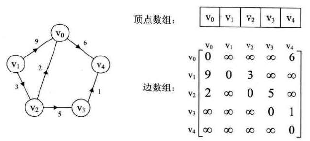
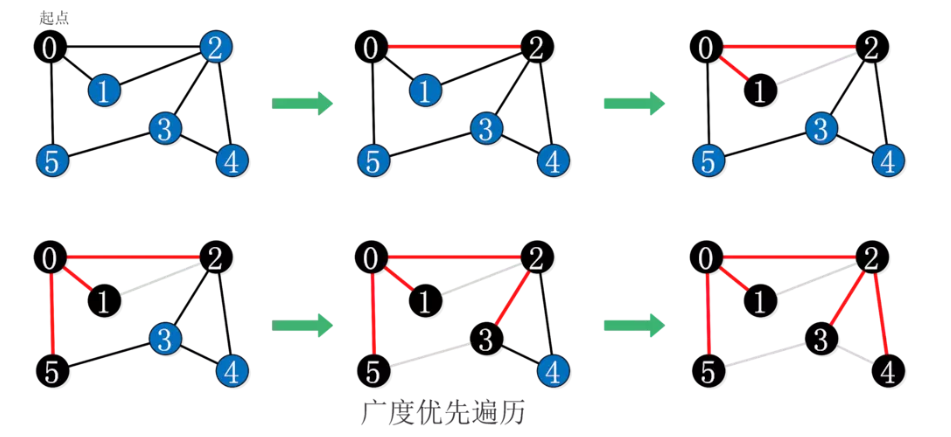
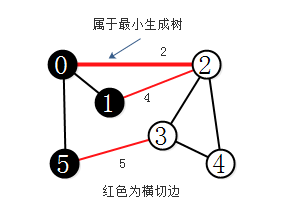
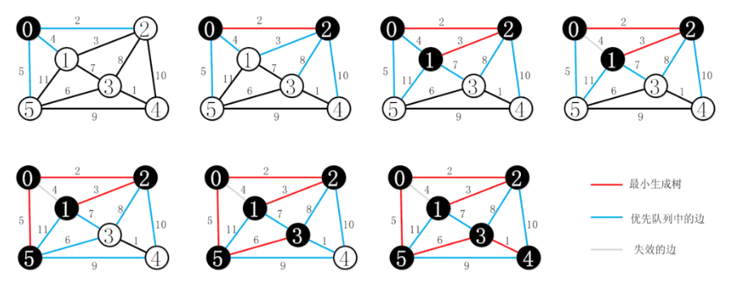
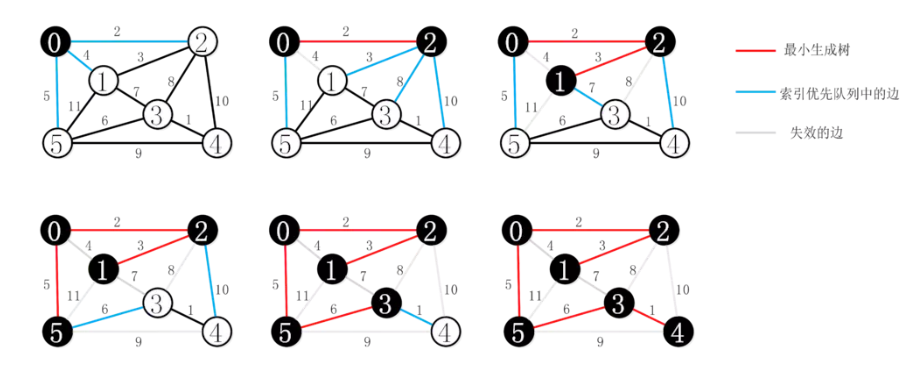

<!-- GFM-TOC -->
* [图](#图)
    * [图的存储结构](#图的存储结构)
        * [邻接矩阵](#邻接矩阵)
        * [邻接表](#邻接表)
    * [图的遍历](#图的遍历)
        * [深度优先遍历](#深度优先遍历)
        * [广度优先遍历](#广度优先遍历)
    * [最小生成树](#最小生成树)
        * [Prim算法](#Prim算法)
        * [Kruskal算法](#Kruskal算法)
    * [最短路径](#最短路径)
        * [Dijkstra算法](#Dijkstra算法)
        * [Floyd算法](#Floyd算法)
# 图
##  图的存储结构
### 邻接矩阵

图的邻接矩阵（Adjacency Matrix）存储方式是用两个数组来表示图。
一个一维数组存储图中顶点信息，一个二维数组（称邻接矩阵）存储图中的边或弧的信息。

<div align="center"></div>

无向图由于边不区分方向，所以其邻接矩阵是一个对称矩阵。
邻接矩阵中的0表示边不存在，主对角线全为0表示图中不存在自环。

<div align="center"></div>

在带权有向图的邻接矩阵中，数字表示权值weight，「无穷」表示弧不存在。
由于权值可能为0，所以不能像在无向图的邻接矩阵中那样使用0来表示弧不存在。

优缺点：

* 优点：结构简单,操作方便

* 缺点：对于稀疏图，这种实现方式将浪费大量的空间。

### 邻接表
<div align="center"></div>

时间复杂度为 O(N + E)，其中N、E分别为顶点数和边数，邻接表实现比较适合表示稀疏图。

无向图的数据结构：
```java
/**
 * 这里的顶点编号是从0开始的
 */
public class Graph {
    private final int V;
    //顶点数目
    private int E;
    //边的数目
    private List<Integer>[] adj;
    //邻接表

    public Graph(int v){
        this.V = v;
        //v表示的是节点数
        this.E=0;
        //初始的时候是没有边的
        adj = (List<Integer>[])new ArrayList[V];
        for(int i=0;i<V;i++){
            adj[i]=new ArrayList<>();
        }
    }

    public int getV(){
        return V;
    }

    public int getE(){
        return E;
    }

    //加入边<v,w>
    public void addEede(int v,int w){
        adj[v].add(w);
        //adj.get(v)，v节点所对应的链表
        adj[w].add(v);
        E++;
    }

    //获取所有与顶点v相连的顶点
    public Iterable<Integer> adj(int v){
        return adj[v];
    }

    public static void main(String[] args) {
        Graph graph=new Graph(4);
        graph.addEede(0,1);
        graph.addEede(0,2);
        graph.addEede(1,2);
        graph.addEede(0,3);

        System.out.println(graph.adj(0));
    }
}
```

有向图的数据结构：
```java
/**
 * 这里的顶点编号是从0开始的
 */
public class DGraph {
    private final int V;
    //图的顶点数
    private int E;

    private List<Integer>[] adj;

    public DGraph(int V) {
        this.V = V;
        this.E = 0;
        adj=(List<Integer>[])new ArrayList[V];
        for(int i=0;i<V;i++) {
            adj[i] = new ArrayList<>();
        }
    }

    public void addEdge(int v,int w){
        adj[v].add(w);
        E++;
    }

    //返回一个顶点的所有邻接点
    public Iterable<Integer> adj(int v) {
       return adj[v];
    }

    //翻转该有向图的方向
    public DGraph reverse(){
        DGraph R=new DGraph(V);
        for(int v=0;v<V;v++){
            for(int w:adj(v)){
                R.addEdge(w,v);
            }
        }
        return R;
    }

    public static void main(String[] args) {
        DGraph dGraph=new DGraph(4);

        dGraph.addEdge(1,0);
        dGraph.addEdge(1,2);
        dGraph.addEdge(2,1);
        dGraph.addEdge(2,0);
        dGraph.addEdge(0,3);
        System.out.println(dGraph.adj(1));

        DGraph rGraph=dGraph.reverse();
        System.out.println(rGraph.adj(1));
    }
}
```

## 图的遍历
从图的某个顶点出发，遍历图中其余顶点，且使每个顶点仅被访问一次，这个过程叫做图的遍历（Traversing Graph）。
对于图的遍历通常有两种方法：
深度优先遍历和广度优先遍历。

### 深度优先遍历

* 基本思想：

首先从图中某个顶点v0出发，访问此顶点，
然后依次从v0相邻的顶点出发深度优先遍历，直至图中所有与0v路径相通的顶点都被访问了；
若此时尚有顶点未被访问，则从中选一个顶点作为起始点，重复上述过程，直到所有的顶点都被访问。

深度优先遍历用递归实现比较简单，只需用一个递归方法来遍历所有顶点，在访问某一个顶点时：

* 1、将它标为已访问

* 2、递归的访问它的所有未被标记过的邻接点

深度优先遍历的过程：

<div align="center"></div>

```java
/**
 * 深度优先搜索
 */
public class DFSPaths {
    private boolean[] visited;
    private int[] edgeTo;
    //记录节点到起点的路径，比如 edgeTo[2]=0,就表示<0,2>路径，2是起点，0是终点
    private final int v0;

    //从顶点v0开始遍历
    public DFSPaths(Graph G,int v0){
        visited=new boolean[G.getV()];
        edgeTo=new int[G.getV()];
        this.v0=v0;
        dfs(G,this.v0);
    }

    public void dfs(Graph G,int v){
        visited[v]=true;
        //判断与v相邻的节点是否被访问了
        for(int w:G.adj(v)){
            if(!visited[w]){
                edgeTo[w]=v;
                //到达w的是v,即w的前一个节点是v
                dfs(G,w);
            }
        }
    }

    public boolean hasPathTo(int v){
        return visited[v];
    }

    //得到起点v0到顶点v的路径
    public Iterable<Integer> pathTo(int v){
        if(!hasPathTo(v)){
            return null;
        }
        Stack<Integer> path=new Stack<>();
        //从v开始进行遍历
        for(int x=v;x!=v0;x=edgeTo[x]){
            path.push(x);
        }
        path.push(v0); //最后加入起点
        return path;
    }

    public static void main(String[] args) {
        Graph g=new Graph(6);
        g.addEede(0,1);
        g.addEede(0,2);
        g.addEede(0,5);
        g.addEede(1,2);
        g.addEede(2,3);
        g.addEede(2,4);
        g.addEede(3,4);
        g.addEede(3,5);

        DFSPaths dfsPaths=new DFSPaths(g,0);
        Stack<Integer> list=(Stack<Integer>) dfsPaths.pathTo(2);
        while(!list.empty()){
            System.out.println(list.pop());
        }
    }
}
```

### 广度优先遍历

* 基本思想：

首先，从图的某个顶点v0出发，访问了v0之后，依次访问与v0相邻的未被访问的顶点，
然后分别从这些顶点出发，广度优先遍历，直至所有的顶点都被访问完。

* 广度优先遍历的过程

<div align="center"></div>

```java
/**
 * 深度优先搜索
 */
public class BFSPaths {
    private boolean[] visited;
    private int[] edgeTo;
    //记录节点到起点的路径，比如 edgeTo[2]=0,就表示<0,2>路径，2是起点，0是终点
    private final int v0;

    //从顶点v0开始遍历
    public BFSPaths(Graph G, int v0){
        visited=new boolean[G.getV()];
        edgeTo=new int[G.getV()];
        this.v0=v0;
        bfs(G,this.v0);
    }

    public void bfs(Graph G,int s){
        Queue<Integer> queue=new LinkedList<>();
        visited[s]=true;
        queue.add(s);
        //判断与v相邻的节点是否被访问了
        while(!queue.isEmpty()){
            int v=queue.poll();
            for(int w:G.adj(v)){
                if(!visited[w]){
                    edgeTo[w]=v;
                    //到达w的是v,即w的前一个节点是v
                    visited[w]=true;
                    queue.add(w);
                }
            }
        }
    }

    public boolean hasPathTo(int v){
        return visited[v];
    }

    //得到起点v0到顶点v的路径
    public Iterable<Integer> pathTo(int v){
        if(!hasPathTo(v)){
            return null;
        }
        Stack<Integer> path=new Stack<>();
        //从v开始进行遍历
        for(int x=v;x!=v0;x=edgeTo[x]){
            path.push(x);
        }
        path.push(v0); //最后加入起点
        return path;
    }

    public static void main(String[] args) {
        Graph g = new Graph(6);
        g.addEede(0, 1);
        g.addEede(0, 2);
        g.addEede(0, 5);
        g.addEede(1, 2);
        g.addEede(2, 3);
        g.addEede(2, 4);
        g.addEede(3, 4);
        g.addEede(3, 5);

        BFSPaths bfsPaths = new BFSPaths(g, 0);
        for (int i = 1; i <= 5; i++) {
            Stack<Integer> list = (Stack<Integer>) bfsPaths.pathTo(i);
            while (!list.empty()) {
                System.out.print(list.pop()+" ");
            }
            System.out.println();
        }
    }
}
```

## 最小生成树
图的生成树是它的一棵含有所有顶点的无环连通子图。
一棵加权图的最小生成树（MST）是它的一棵权值（所有边的权值之和）最小的生成树。

计算最小生成树可能遇到的情况：

* 非连通的无向图，不存在最小生成树

* 权重不一定和距离成正比

* 权重可能是0或负数

* 若存在相等的权重，那么最小生成树可能不唯一

### 图的切分
图的切分是将图的所有顶点分为两个非空且不重叠的两个集合。
**横切边**是一条连接两个属于不同集合的顶点的边。

* 切分定理

在一幅加权图中，给定任意的切分，它的横切边中的权重最小者必然属于图的最小生成树。

切分定理是解决最小生成树问题的所有算法的基础。这些算法都是贪心算法。

### Prim算法

<div align="center"></div>

* 算法思想：

每次将权值最小的横切边加入生成树中

* 1、Prim算法的延迟实现

<div align="center"></div>

从顶点0开始，首先将顶点0加入到树中（标记），顶点0和其它点的
横切边（这里即为顶点0的邻接边）加入优先队列，将权值最小的横切边出队，加入生成树中。
此时相当于也向树中添加了一个顶点2，
接着将集合（顶点1，2组成）和另一个集合（除1,2的顶点组成）间的横切边加入到优先队列中，
如此这般，直到队列为空。

注意：若横切边中另一个顶点在树中，则此边失效。

```java
public class LazyPrimMST {
    private boolean[] marked;
    //标记该顶点在mst中
    private Queue<Edge> mst;
    //mst的边的集合
    private PriorityQueue<Edge> pq;

    public LazyPrimMST(EdgeWeightGraph G){
        pq=new PriorityQueue<>();
        marked=new boolean[G.getV()];
        mst=new LinkedList<>();

        //从0开始访问
        visit(G,0);
        while(!pq.isEmpty()){
            //从pq中得到权重最小存的边
            Edge e=pq.poll();
            int v=e.either();
            int w=e.other(v);
            //TODO：v和w已经被访问过，那么<v,w>这条边，就不能加入mst树中
            if(marked[v] && marked[w]){
                continue;
            }
            mst.add(e);
            if(!marked[v]){
                visit(G,v);
            }
            if(!marked[w]){
                visit(G,w);
            }
        }
    }

    private void visit(EdgeWeightGraph G, int v) {
        marked[v]=true;
        //访问所有与v相邻的节点，如果该节点e.other(v)未被访问，那么就将这条边加入到pq中
        for(Edge e:G.adj(v)){
            if(!marked[e.other(v)]){
                pq.add(e);
            }
        }
    }

    public Iterable<Edge> edges(){
        return mst;
    }
}
```
* 2、Prim算法即时实现（了解）
    
基于Prim算法的延迟实现，我们可以在优先队列中只保存每个非树顶点V的一条边
（即它与树中的顶点连接起来的权重最小的那条边），因为其他权重较大的边迟早都会失效。

<div align="center"></div>

### Kruskal算法

* 算法思想：

Kruskal算法的思想是按照边的权重顺序来生成最小生成树，
首先将图中所有边加入优先队列，将权重最小的边出队加入最小生成树，
保证加入的边不与已经加入的边形成环，直到树中有(V-1)条边为止。

```java
public class KruskalMST {
    //存储最小生成树的边
    private Queue<Edge> mst;
    //优先队列，维持（V-1）条边
    private PriorityQueue<Edge> pq;
    //用来判断边与边是否形成回路
    private int[] parent;

    public KruskalMST(EdgeWeightGraph G){
        mst=new LinkedList<>();
        pq=new PriorityQueue<>();
        //将该图中所有的顶点都加入优先队列中
        for(Edge e:G.getEdges()){
            pq.add(e);
        }
        parent=new int[G.getV()];

        //mst树最多有(V-1)条边
        while(!pq.isEmpty() && mst.size() < G.getV() - 1) {
            Edge e=pq.poll();
            int v=e.either();
            int w=e.other(v);
            int m=find(v);
            int n=find(w);
            if(m!=n){
                //表示此边没有与生成树形成环路
                parent[m] = n;
                mst.add(e);
            }
        }
    }

    //查找连接树的尾部下标
    private int find(int v) {
        //v是节点编号
        while(parent[v] > 0) {
            v = parent[v];
        }
        return v;
    }

    public Iterable<Edge> getMST() {
        return mst;
    }
}
```

## 最短路径

最短路径指两顶点之间经过的边上权值之和最少的路径，并且称路径上的第一个顶点为源点，最后一个顶点为终点。

### Dijkstra算法

- [点我完善](https://www.jianshu.com/p/57eddea86f00)

### Floyd算法

- [点我完善](https://www.jianshu.com/p/5870c56f3ac5)