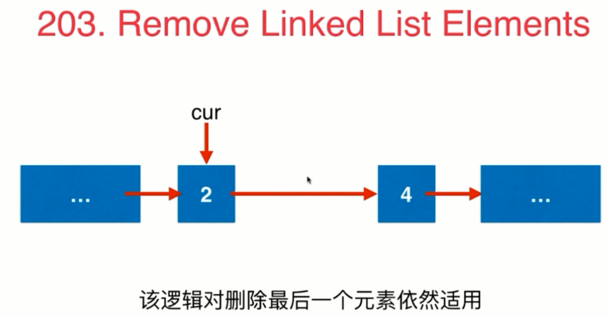
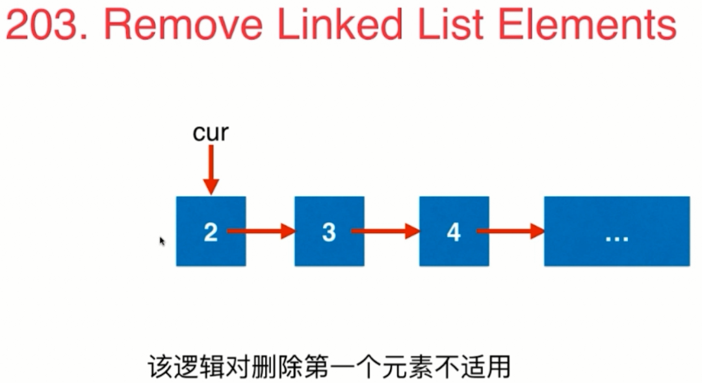

# [第三章 链表问题](#链表问题)

| 章节 | 典型题目 | 相关题目 | 更多扩展练习 | 难题推荐 |
| :---: | :---: | :---: | :---: | :---: |
| [3-1 链表，在节点间穿针引线 Reverse Linked List](#链表在节点间穿针引线) | [206](#206) | [92](#92) | | |
| [3-2 测试你的链表程序](#测试你的链表程序) | [206](#206) | [83](#83) [86](#86) [328](#328) [2](#2) [445](#445) | | |
| [3-3 设立链表的虚拟头结点 Remove Linked List Elements](#设立链表的虚拟头结点) | [203](#203) | [82](#82) [21](#21) | | |
| [3-4 复杂的穿针引线 Swap Nodes in Pairs](#复杂的穿针引线) | [24](#24) | [25](#25) [147](#147) [148](#148) | | |
| [3-5 不仅仅是穿针引线 Delete Node in a Linked List](#不仅仅是穿针引线) | [237](#237) | [无] | | |
| [3-6 链表与双指针 Remove Nth Node Form End of List](#链表与双指针) | [19](#19) | [61](#61) [143](#143) [234](#234) | | |
| [补充1：更多链表中的问题](#更多链表中的问题) | [无] | [无] | [725](#725) [817](#817) [876](#876) | | 
| [补充2：Floyd环检测算法](#Floyd环检测算法) | [无] | [无] | [141](#141) [142](#142) | [287](#287) |


# 链表问题
## 链表在节点间穿针引线
### 206
[206 Reverse Linked List](https://leetcode.com/problems/reverse-linked-list/description/)

* 问题描述：

<div align="center"></div>

* 解题：

<div align="center"></div>
<div align="center"></div>
<div align="center"></div>

非递归方式：
```java
public ListNode reverseList1(ListNode head) {
    ListNode pre=null;
    ListNode cur=head;

    while(cur!=null){
        ListNode next=cur.next;
        cur.next=pre;
        pre=cur;
        cur=next;
    }
    return pre;
}
```
递归方式：
```java
public ListNode reverseList(ListNode head) {
    if(head==null || head.next==null){
        return head;
    }

    ListNode next=head.next;
    head.next=null;
    ListNode newNode=reverseList(next);
    next.next=head;
    return newNode;
}
```

### 92
[92 Reverse Linked List II](https://leetcode.com/problems/reverse-linked-list-ii/description/)

* 解题：

<div align="center"></div>

```java
public ListNode reverseBetween(ListNode head, int m, int n) {
    if(m>=n){
        return head;
    }
    if(head==null || head.next==null){
        return head;
    }

    ListNode newHead=new ListNode(0);
    newHead.next=head;
    head=newHead;
    ListNode preNode=head;
    //保存的是指向m位置的前一个节点，也就是(m-1)位置
    for(int i=0;i<m-1;i++){
        preNode=preNode.next;
    }
    ListNode nodeA = preNode.next;
    ListNode nodeB = preNode.next.next;
    //cur此时是当前要翻转的节点
    for(int i=0;i<n-m;i++){
        nodeA.next=nodeB.next;
        nodeB.next=preNode.next;
        preNode.next=nodeB;
        nodeB=nodeA.next;
    }
    return head.next;
}
```
## 测试你的链表程序
### 83
[83 Remove Duplicates from Sorted List](https://leetcode.com/problems/remove-duplicates-from-sorted-list/description/)

<div align="center"></div>

```java
public ListNode deleteDuplicates(ListNode head) {
    if(head==null || head.next==null){
        return head;
    }
    ListNode cur=head;
    ListNode newCur=head.next;

    while(newCur!=null){
        //ListNode next=cur.next;
        if(cur.val==newCur.val){
            cur.next=newCur.next;
        }else{
            cur=newCur;
        }
        newCur=newCur.next;
    }
    return head;
}
```
### 86
[86 Partition List](https://leetcode.com/problems/partition-list/description/)
```java
//注意：要保留元素相对位置
//准备两个链表，分别指向 <x 的元素，和>=x的元素
//然后将这两个链表合并
public ListNode partition(ListNode head, int x) {
    if(head==null || head.next==null){
        return head;
    }
    ListNode lessHead=new ListNode(0);
    ListNode moreOrEqualHead=new ListNode(0);

    ListNode less=lessHead;// 存储<x的元素
    ListNode moreOrEqual=moreOrEqualHead;//存储>=x的元素
    ListNode cur=head;
    while(cur!=null){
        if(cur.val<x){
            less.next=cur;
            less = less.next;
        }else{
            moreOrEqual.next=cur;
            moreOrEqual=moreOrEqual.next;
        }
        cur=cur.next;
    }

    //将两个链表连接起来
    less.next=moreOrEqualHead.next;
    //注意最后一个元素，要进行处理
    moreOrEqual.next=null;

    //释放头结点元素
    moreOrEqual.next=null;
    ListNode retNode=lessHead.next;
    lessHead.next=null;

    return retNode;
}
```
### 328
[328 Odd Even Linked List](https://leetcode.com/problems/odd-even-linked-list/description/)
```java
//node的num是从1开始编号的
public ListNode oddEvenList(ListNode head) {
    if(head==null || head.next==null){
        return head;
    }
    ListNode oddHead=new ListNode(-1);
    ListNode evenHead=new ListNode(-1);
    int num=1;
    ListNode cur=head;
    ListNode odd=oddHead;
    ListNode even=evenHead;
    while(cur!=null){
        if(num%2==1){
            odd.next=cur;
            odd=odd.next;
        }else{
            even.next=cur;
            even=even.next;
        }
        cur=cur.next;
        num++;
    }

    odd.next=evenHead.next;
    even.next=null;

    evenHead.next=null;
    ListNode retNode=oddHead.next;
    oddHead.next=null;
    return retNode;
}
```
### 2
[2 Add Two Numbers](https://leetcode.com/problems/add-two-numbers/description/)

* 背景：

头插法和尾插法建立链表原理图：

头插法：

<div align="center"></div>

尾插法：

<div align="center"></div>

* 解题：

这里要特别注意链表新增节点的情况：

比如：

l1:2-->4-->9-->9-->NULL

l2:5-->6-->4-->8-->NULL

这里 从左向右依次相加后 , 9+8+1=18 ,这时候就要新建一个节点，而该节点的数值始终是1。

<div align="center"></div>

<div align="center"></div>

```java
public ListNode addTwoNumbers(ListNode l1, ListNode l2) {
    ListNode dummyHead=new ListNode(-1);
    ListNode tail=dummyHead;

    int jinWei=0;
    while(l1!=null || l2!=null){
        if(l1!=null){
            jinWei+=l1.val;
            l1=l1.next;
        }
        if(l2!=null){
            jinWei+=l2.val;
            l2=l2.next;
        }
        ListNode newNode=new ListNode(jinWei%10);
        tail.next=newNode;
        tail=newNode;
        jinWei/=10;
    }
    if(jinWei==1){
        ListNode newNode=new ListNode(1);
        tail.next=newNode;
        tail=newNode;
    }

    ListNode retNode=dummyHead.next;
    dummyHead=null;
    return retNode;
}
```
### 445
[445 Add Two Numbers II](https://leetcode.com/problems/add-two-numbers-ii/description/)
```java
public ListNode addTwoNumbers(ListNode l1, ListNode l2) {
    if(l1==null){
        return l2;
    }
    if(l2==null){
        return l1;
    }
    //题目要求不能直接反转链表，那么只能借助栈来实现链表的反转
    Stack<Integer> stack1=new Stack<>();
    Stack<Integer> stack2=new Stack<>();

    //实现链表l1的反转
    while(l1!=null){
        stack1.push(l1.val);
        l1=l1.next;
    }
    //实现链表l2的反转
    while(l2!=null){
        stack2.push(l2.val);
        l2=l2.next;
    }

    ListNode dummyHead=new ListNode(-1);

    //模仿Code_2_AddTwoNumbers的剧情了！！！！,但是这里创建链表采用头插法
    int tmp=0;
    while(!stack1.empty() || !stack2.empty()){
        if(!stack1.empty()){
            tmp+=stack1.pop();
        }
        if(!stack2.empty()){
            tmp+=stack2.pop();
        }
        ListNode newNode=new ListNode(tmp%10);
        newNode.next=dummyHead.next;
        dummyHead.next=newNode;
        tmp/=10;
    }
    if(tmp==1){
        ListNode newNode=new ListNode(1);
        newNode.next=dummyHead.next;
        dummyHead.next=newNode;
    }

    ListNode retNode=dummyHead.next;
    dummyHead=null;

    return retNode;
}
```
        
## 设立链表的虚拟头结点
### 203
[203 Remove Linked List Elements](https://leetcode.com/problems/remove-linked-list-elements/description/)

* 问题：

在链表中删除数值为val的所有节点

* 示例：

1->2->6->3->4->5->6->NULL,删除值为6的节点

返回 1->2->3->4->5->NULl

* 解题：

<div align="center"></div>
<div align="center"></div>
<div align="center"></div>
<div align="center"></div>

```java
public ListNode removeElements(ListNode head, int val) {
    if(head==null){
        return head;
    }
    //创建一个虚拟的头结点
    ListNode dummyHead=new ListNode(0);
    dummyHead.next=head;

    ListNode cur=dummyHead;
    while(cur.next!=null){
        //cur指向被删除元素的前一个元素,cur.next就是要删除的元素
        if(cur.next.val==val){
            ListNode delNode=cur.next;
            cur.next=delNode.next;
            //删除该节点，直接赋值为null,让JVM进行垃圾回收就行了
            delNode.next=null;
        }else{
            cur=cur.next;
        }
    }

    ListNode retNode=dummyHead.next;
    dummyHead.next=null;
    return retNode;
}
```
### 82
[82 Remove Duplicates from Sorted List II](https://leetcode.com/problems/remove-duplicates-from-sorted-list-ii/description/)

<div align="center"></div>

```java
public ListNode deleteDuplicates(ListNode head) {
    if(head==null || head.next==null){
        return head;
    }

    ListNode dummyHead=new ListNode(0);
    dummyHead.next=head;

    ListNode pre=dummyHead;//指向相同元素的前一个元素
    ListNode cur=pre.next; //指向当前元素

    while(cur.next!=null){
      if(cur.val!=cur.next.val){
          if(pre.next==cur){
              pre=cur;
          }else{
              //删除cur元素
              pre.next=cur.next;
          }
      }
      cur=cur.next;
    }
    //cur此时是最后一个元素，如果pre.next不是最后一个元素，则pre就是最后一个元素了
    if(pre.next!=cur){
        pre.next=null;
    }

    ListNode retNode=dummyHead.next;
    dummyHead.next=null;

    return retNode;
}
```
### 21
[21. Merge Two Sorted Lists](https://leetcode.com/problems/merge-two-sorted-lists/description/)
```java
//时间复杂度 O(n)
//空间复杂度 O(1)
public ListNode mergeTwoLists(ListNode l1, ListNode l2) {
    if(l1==null){
        return l2;
    }
    if(l2 ==null){
        return l1;
    }

    ListNode dummyHead=new ListNode(0);

    ListNode cur1=l1;
    ListNode cur2=l2;
    ListNode cur=dummyHead;
    while(cur1!=null && cur2!=null){
        if(cur1.val <cur2.val){
            cur.next=cur1;
            cur1=cur1.next;
        }else{
           cur.next=cur2;
           cur2=cur2.next;
        }
        cur=cur.next;
    }
    if(cur1!=null){
        cur.next=cur1;
    }
    if(cur2!=null){
        cur.next=cur2;
    }

    ListNode retNode=dummyHead.next;
    dummyHead.next=null;
    return retNode;
}
```

## 复杂的穿针引线
### 24
[24 Swap Nodes in Pairs](https://leetcode.com/problems/swap-nodes-in-pairs/description/)

* 问题：

给定一个链表，对于每两个相邻的节点交换其位置

* 示例：

1->2->3->4->NULL

返回 2->1->4->3->NULL

* 解题：

<div align="center"></div>
<div align="center"></div>
<div align="center"></div>
<div align="center"></div>
<div align="center"></div>

```java
public ListNode swapPairs(ListNode head) {
    if(head==null || head.next==null){
        return head;
    }
    ListNode dummyHead=new ListNode(0);
    dummyHead.next=head;
    
    ListNode p=dummyHead;
    while(p.next!=null && p.next.next!=null){
        //保证有要交换的两个节点
        ListNode node1=p.next;
        ListNode node2=node1.next;
        ListNode next=node2.next;

        node2.next=node1;
        node1.next=next;
        p.next=node2;

        p=node1;
    }

    ListNode retNode=dummyHead.next;
    dummyHead.next=null;

    return retNode;
}
```
### 25
[25 Reverse Nodes in k-Group](https://leetcode.com/problems/reverse-nodes-in-k-group/description/)

* 问题：

给出一个链表，将这个链表以k个结点为一组进行翻转，不够k个的部分就保持原样不进行翻转

* 示例：

Given this linked list: 1->2->3->4->5

For k = 2, you should return: 2->1->4->3->5

For k = 3, you should return: 3->2->1->4->5

```java
public ListNode reverseKGroup(ListNode head, int k) {
    if(k==1){
        return head;
    }
    ListNode root = new ListNode(-1);
    root.next=head;
    ListNode dummyHead=root;

    int n=0;
    //统计链表中节点数
    ListNode cur=head;
    while(cur!=null){
        n++;
        cur=cur.next;
    }
    //root.next指向子链表里的第一个节点，
    //head为第一个节点，反转一次即变成第二个节点，从而保证他后面的节点就是下一个将被放到前面的节点。
    while(n>=k){
        //这样循环的巧妙之处，就是循环的次数。
        //反转 后面的（k-1）个元素
        for(int j = 0 ; j < k-1; j++){
            ListNode node = root.next;
            root.next = head.next;
            head.next = root.next.next;
            root.next.next = node;
        }
        root = head;
        head = head.next;
        n-=k;
    }

    ListNode retNode=dummyHead.next;
    dummyHead=null;

    return retNode;
}
```
### 147
[147 Insertion Sort List](https://leetcode.com/problems/insertion-sort-list/description/)

<div align="center"></div>

```java
public ListNode insertionSortList(ListNode head) {
    if(head==null || head.next==null){
        return head;
    }

    ListNode dummyHead=new ListNode(-1);

    ListNode pre=dummyHead;
    //pre始终指向要插入节点的前一个节点

    ListNode cur=head;

    while(cur!=null){
        pre=dummyHead;
        //每次循环，都要将pre初始化，方便定位要插入的节点的前一个位置
        while(pre.next!=null && pre.next.val<cur.val){
            pre=pre.next;
        }
        ListNode tmp=cur.next;
        //将 cue插入到链表中,在 pre-->pre.next之间插入
        cur.next=pre.next;
        pre.next=cur;
        cur=tmp;
    }

    ListNode retNode=dummyHead.next;
    dummyHead=null;

    return retNode;
}
```
### 148
[148 Sort List](https://leetcode.com/problems/sort-list/description/)

```java
//有O(n lgn)时间复杂度的算法为，快速排序，堆排序，归并排序
//这里就使用归并排序
public ListNode sortList(ListNode head) {
    if (head == null || head.next == null) {
        return head;
    }
    //获取该链表的中间节点
    ListNode midNode=getMidOfList(head);
    //此时链表分为两个部分 ：
    // head->...->midNode的前一个节点
    // midNOde->..->NULL
    return mergeTwoSortedList(sortList(head),sortList(midNode));
}

//获取链表中间节点，将两个子链表分离
private ListNode getMidOfList(ListNode head){
    //这里保证了至少有两个节点
    ListNode slow=head;
    ListNode fast=head;
    ListNode pre=head;
    while(slow!=null && fast!=null){
        pre=slow;
        slow=slow.next;
        fast=fast.next;
        //注意fast是快指针，每次走两步，但是当链表中节点数是奇数时，就会有问题，
        //所以走第二步时，要先进行判断
        if(fast!=null){
            fast=fast.next;
        }else{
            break;
        }
    }
    pre.next=null;
    return slow;
}

//合并两个有序的链表
private ListNode mergeTwoSortedList(ListNode head1,ListNode head2){
    if(head1==null){
        return head2;
    }
    if(head2==null){
        return head1;
    }
    ListNode dummyHead=new ListNode(-1);
    ListNode cur=dummyHead;
    while(head1!=null && head2!=null){
        if(head1.val<head2.val){
            cur.next=head1;
            head1=head1.next;
        }else{
            cur.next=head2;
            head2=head2.next;
        }
        cur=cur.next;
    }
    if(head1!=null){
        cur.next=head1;
    }
    if(head2!=null){
        cur.next=head2;
    }
    ListNode retNode=dummyHead.next;
    dummyHead=null;
    return retNode;
}
```

## 不仅仅是穿针引线
### 237
[237 Delete Node in a Linked List](https://leetcode.com/problems/delete-node-in-a-linked-list/description/)

* 问题：

给定一个链表中的节点，删除该节点

<div align="center"></div>
<div align="center"></div>

* 解题：

```java
public void deleteNode(ListNode node) {
    if(node==null){
        return;
    }

    if(node.next==null){
        //说明node是最后一个节点,直接删除即可
        node=null;
        return;
    }
    node.val=node.next.val;
    ListNode delNode=node.next;
    node.next=delNode.next;
    delNode.next=null;
}
```

## 链表与双指针
### 19
[19 Remove Nth Node From End of List](https://leetcode.com/problems/remove-nth-node-from-end-of-list/description/)

* 问题：

给定一个链表，删除倒数第n个节点

* 示例：

1->2->3->4->5->NULL,n=2

返回1->2->3->5

* 解题：

n是从1开始的，p指向倒数n个节点的前一个节点，方便删除目标节点：

<div align="center"></div>

<div align="center"></div>

```java
public ListNode removeNthFromEnd(ListNode head, int n) {
    if(n<0){
        return head;
    }

    ListNode dummyHead=new ListNode(0);
    dummyHead.next=head;

    ListNode p=dummyHead;
    ListNode q=dummyHead;
    //q指向的是p后面的第（n+1）个节点
    for(int i=0;i<n+1;i++){
        //如果n太大的话,q有可能指向null
        if(q==null){
            break;
        }
        q=q.next;
    }
    while(q!=null){
        p=p.next;
        q=q.next;
    }

    //删除目标节点
    ListNode delNode=p.next;
    p.next=delNode.next;

    ListNode retNode=dummyHead.next;
    dummyHead=null;

    return retNode;
}
```
### 61
[61 Rotate List](https://leetcode.com/problems/rotate-list/description/)

* 解题：

思路一：

1、链表为空，就直接返回

2、k==0 || k==n*len 时，链表是不变的。

所以当判断条件是 k%len==0时，直接返回原来的链表。

3、此时在链表中实际向右旋转 k=k%len位置。

4、这里的旋转实际上就是子链表的平移

比如：1->2->3->4->5->NULL, k = 2

就是将 4->5 连接到1->2->3的前面

```java
public ListNode rotateRight(ListNode head, int k) {
    int len=0;
    ListNode cur=head;
    while(cur!=null){
        len++;
        cur=cur.next;
    }
    if(len==0){
        return head;
    }
    k=k%len;
    if(k==0){
        return head;
    }

    ListNode dummyHead=new ListNode(-1);
    dummyHead.next=head;

    ListNode p=dummyHead;
    ListNode preq=null; //始终指向q节点的前一个节点
    ListNode q=dummyHead;
    //先定位q指向（k+1）位置
    for(int i=0;i<k+1;i++){
        preq=q;
        q=q.next;
    }

    while(q!=null){
        p=p.next;
        preq=q;
        q=q.next;
    }
    //现在p指向倒数第k个位置的前一个位置
    head=p.next;
    p.next=null;
    preq.next=dummyHead.next;
    return head;
}
```

思路二：

```java
public ListNode rotateRight(ListNode head, int k) {
     if(head==null || head.next==null){
         return head;
     }
     int len=1;
     ListNode cur=head;
     while(cur.next!=null){
         len++;
         cur=cur.next;
     }
     //cur指向最后一个元素
     k=k%len;
     if(k==0){
         return head;
     }
 
     ListNode p=head;
     //先定位q指向（len-k-1）位置
     for(int i=0;i<len-k-1;i++){
         p=p.next;
     }
 
     ListNode tmp=p.next;
     p.next=null;
     cur.next=head;
     head=tmp;
     return head;
 }
```
### 143
[143 Reorder List](https://leetcode.com/problems/reorder-list/description/)
```java
public void reorderList(ListNode head) {
    if(head==null || head.next==null){
        return;
    }

    //先将该链表拆成两个部分:
    // L0→L1→...→L(n/2) ==> head1
    // L(n/2+1)→L1→...→L(n) ==> head2
    ListNode slow=head;
    ListNode fast=head;
    while(slow!=null && fast.next!=null && fast.next.next!=null){
        slow=slow.next;
        fast=fast.next.next;
    }

    ListNode head2=slow.next;
    slow.next=null;
    ListNode head1=head;

    //先反转head2链表
    head2=reverseList(head2);

    //合并这两张表
    ListNode p=head1;
    ListNode q=head2;
    while(p!=null && q!=null){
        ListNode next1=p.next;
        ListNode next2=q.next;
        q.next=next1;
        p.next=q;
        p=next1;
        q=next2;
    }
    head=head1;
}

//反转链表
public ListNode reverseList(ListNode head) {
    ListNode pre=null;
    ListNode cur=head;

    while(cur!=null){
        ListNode next=cur.next;
        cur.next=pre;
        pre=cur;
        cur=next;
    }
    return pre;
}
```
### 234
[234 Palindrome Linked List](https://leetcode.com/problems/palindrome-linked-list/description/)
```java
public boolean isPalindrome(ListNode head) {
    if(head==null || head.next==null){
        return true;
    }
    ListNode fast=head;
    ListNode slow=head;
    while(slow!=null && fast.next!=null && fast.next.next!=null){
        slow=slow.next;
        fast=fast.next.next;
    }

    ListNode head1=head;
    ListNode head2=slow.next;
    slow.next=null;
    head2=reverseList(head2);

    while(head1!=null && head2!=null){
        if(head1.val!=head2.val){
            return false;
        }
        head1=head1.next;
        head2=head2.next;
    }
    return true;
}

//反转链表
public ListNode reverseList(ListNode head) {
    ListNode pre=null;
    ListNode cur=head;

    while(cur!=null){
        ListNode next=cur.next;
        cur.next=pre;
        pre=cur;
        cur=next;
    }
    return pre;
}
```
## 更多链表中的问题
### 725 
[725 Split Linked List in Parts](https://leetcode.com/problems/split-linked-list-in-parts/description/)
```java
/**
 * 思路：
 * cnt/k：每段链表的最短长度
 * mod=cnt%k：链表的修正长度，就是长度不能被k整除后，所得的余数分散到前mod个链表中
 */
public ListNode[] splitListToParts(ListNode root, int k) {
    ListNode[] res=new ListNode[k];

    //len数组记录苏分割的相应的链表的长度
    int[] len=new int[k];

    int cnt=getCount(root);

    //每段链表的最短长度
    int perLen=cnt/k;
    //链表的修正长度，就是长度不能被k整除后，所得的余数分散到前mod个链表中
    int mod=cnt%k;
    for(int i=0;i<k;i++){
        len[i]=perLen;
        if(mod>0){
            len[i]++;
            mod--;
        }
    }

    for(int i=0;i<k;i++){
        res[i]=root;
        root=getNextRoot(root,len[i]);
    }
    return res;
}

//统计链表中节点数
private int getCount(ListNode root){
    int count=0;
    ListNode cur=root;
    while (cur!=null){
        count++;
        cur=cur.next;
    }
    return count;
}

//在原链表中截取长度为size的链表,在[0..size-1]的链表的下一个链表
//这是编程的核心
private ListNode getNextRoot(ListNode root,int size){
    if(root==null){
        return null;
    }
    while(root!=null && size-1>0){
        root=root.next;
        size--;
    }
    ListNode res=root;
    if(res!=null){
        res=res.next;
    }
    //root此时是上一个节点的尾节点
    if(root!=null){
        root.next=null;
    }
    return res;
}
```
### 817 
[817 Linked List Components](https://leetcode.com/problems/linked-list-components/description/)
```java
/**
 * 思路：
 * 我们顺次检查链表中的节点是否出现在G中，如果出现了，
 * 则增加一个统计，并连续跟踪直到当前的连续序列结束。
 * 这样遍历完成一遍列表，就可以获得预期答案。
 */
public int numComponents(ListNode head, int[] G) {
    Set<Integer> set=new HashSet<>();
    int res=0;

    for(int i=0;i<G.length;i++){
        set.add(G[i]);
    }

    ListNode cur=head;
    while(cur!=null){
        //检查cur结点是都在G中
        if(set.contains(cur.val)){
            res++;
            while(cur!=null && set.contains(cur.val)){
                cur=cur.next;
            }
        }
        if(cur!=null){
            cur=cur.next;
        }
    }
    return res;
}
```
### 876
[876 Middle of the Linked List](https://leetcode.com/problems/middle-of-the-linked-list/description/)
```java
public ListNode middleNode(ListNode head) {
    ListNode fast=head;
    ListNode slow=head;
    while(slow!=null && (fast!=null && fast.next!=null)){
        slow=slow.next;
        fast=fast.next.next;
    }
    return slow;
}
```

## Floyd环检测算法
### 141 
[141 Linked List Cycle](https://leetcode.com/problems/linked-list-cycle/description/)
```java
public boolean hasCycle(ListNode head) {
    if(head==null)
        return false;
    ListNode slow=head;
    ListNode fast=head.next;
    while(slow!=null && 
        (fast!=null && fast.next!=null)){
        if(fast==slow)
            return true;
        //fast!=null && fast.next!=null) 保证了一次走两步
        slow=slow.next;
        fast=fast.next.next;
    }
    return false;
}
```

### 142
[142 Linked List Cycle II](https://leetcode.com/problems/linked-list-cycle-ii/description/)

* 解题一：

<div align="center"></div>

```java
/*
 * 思路一：断链法
 * 但是题目要求不能改变链表
 */
public ListNode detectCycle1(ListNode head) {
    if(head==null || head.next==null){
        return null;
    }

    ListNode pre=head;
    ListNode cur=head.next;
    while(cur!=null){
        pre.next=null;
        pre=cur;
        cur=cur.next;
    }
    //说明没有环
    if(pre==cur){
        return null;
    }
    return pre;
}
```
* 解题二：
```java
/**
* 思路二：快慢指针
*/
public ListNode detectCycle(ListNode head) {
    if (head == null || head.next == null) {
        return null;
    }
    ListNode fast=head;
    ListNode slow=head;
    while(slow!=null &&
            (fast!=null && fast.next!=null)){
        slow=slow.next;
        fast=fast.next.next;
        if(slow==fast){
            break;
        }
    }

    slow=head;
    if(fast==null || fast.next==null){
        return null;
    }
    while(fast!=slow){
        fast=fast.next;
        slow=slow.next;
    }
    return slow;
}
```
### 287
[287 Find the Duplicate Number](https://leetcode.com/problems/find-the-duplicate-number/description/)
```java
/**
 * 思路：
 * 链表快指针与慢指针的应用
 * 将数组抽象为一条线和一个圆环，因为1～n 之间有n＋1个数，所以一定有重复数字出现，所以重复的数字即是圆环与线的交汇点。
 * 然后设置两个指针，一个快指针一次走两步，一个慢指针一次走一步。
 * 当两个指针第一次相遇时:
 * 令快指针回到原点（0）且也变成一次走一步，
 * 慢指针则继续前进，再次会合时即是线与圆环的交汇点。
 */
public int findDuplicate(int[] nums) {
    if(nums.length<=1){
        //返回值不在[1...nums.length]之间即可
        return 0;
    }
    int slow=nums[0];
    int fast=nums[nums[0]];
    while(slow!=fast){
        slow=nums[slow];
        fast=nums[nums[fast]];
    }
    fast=0;
    while(fast!=slow){
        slow=nums[slow];
        fast=nums[fast];
    }
    return slow;
}
```