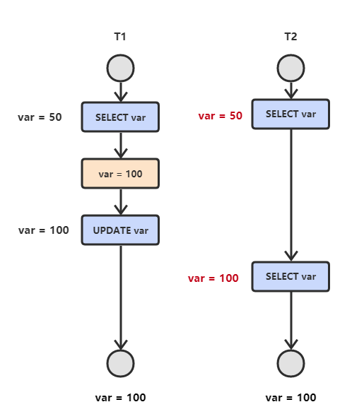

<!-- GFM-TOC -->
* [二、并发一致性问题](#二并发一致性问题)
    * [丢失修改](#丢失修改)
    * [读脏数据](#读脏数据)
    * [不可重复读](#不可重复读)
    * [幻影读](#幻影读)
<!-- GFM-TOC -->

# 二、并发一致性问题

在并发环境下，事务的隔离性很难保证，因此会出现很多并发一致性问题。

## 丢失修改

T1 和 T2 两个事务都对一个数据进行修改，T1 先修改，T2 随后修改，T2 的修改覆盖了 T1 的修改。

  
 

## 读脏数据

T1 修改一个数据，T2 随后读取这个数据。如果 T1 撤销了这次修改，那么 T2 读取的数据是脏数据。

  
 

## 不可重复读

T2 读取一个数据，T1 对该数据做了修改。如果 T2 再次读取这个数据，此时读取的结果和第一次读取的结果不同。

  
 

## 幻影读

T1 读取某个**范围**的数据，T2 在这个**范围**内插入新的数据，T1 再次读取这个**范围**的数据，此时读取的结果和和第一次读取的结果不同。

  
 

----

产生并发不一致性问题主要原因是破坏了事务的**隔离性**，解决方法是通过**并发控制**来保证隔离性。并发控制可以通过封锁（加锁）来实现，但是封锁操作需要用户自己控制，相当复杂。数据库管理系统提供了事务的隔离级别，让用户以一种更轻松的方式处理并发一致性问题。