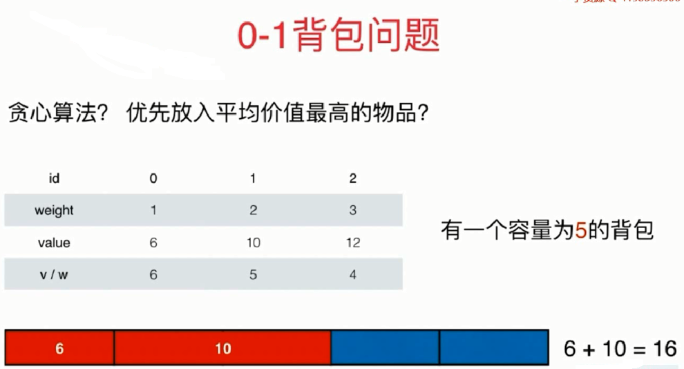

# [第八章 贪心算法](#贪心算法)

| 章节 | 典型题目 | 相关题目 | 更多扩展练习 | 难题推荐 |
| :---: | :---: | :---: | :---: | :---: |
| [8-1 贪心基础 Assign Cookies](#贪心基础) | [455](#455) | [392](#392) | [561](#561) | |
| [8-2 贪心算法与动态规划的关系 Non-overlapping Intervals](#贪心算法与动态规划的关系) | [435](#435) | [无] | | |
| [8-3 贪心选择性质的证明](#贪心选择性质的证明) | [无] | [无] | | |
| [8-4 背包相关问题](#背包相关问题)| [881](#881) | | | |
| [8-5 区间相关问题](#区间相关问题)| [452](#452) | | | |
| [8-6 哈夫曼编码](#哈夫曼编码) | | | | |
| [补充1：更多贪心问题](#更多贪心问题) | [无] | [无] | [860](#860) [861](#861) [870](#870)  | 765 |

# 贪心算法
## 贪心基础
### 455
[455 Assign Cookies](https://leetcode.com/problems/assign-cookies/description/)

* 问题：

假设你是一位很棒的家长，想要给你的孩子们一些小饼干。
但是，每个孩子最多只能给一块饼干。
对每个孩子 i ，都有一个胃口值 g(i) ，这是能让孩子们满足胃口的饼干的最小尺寸；
并且每块饼干 j ，都有一个尺寸 s(j) 。如果 s(j) >= g(i) ，
我们可以将这个饼干 j 分配给孩子 i ，这个孩子会得到满足。
你的目标是尽可能满足越多数量的孩子，并输出这个最大数值。

* 示例：

g=[1,2,3],s=[1,1],结果为1

g=[1,2],s=[1,2,3]，结果为2

* 解题：

贪心策略：每次选取最大的饼干给最"贪心"的小朋友。

```java
public int findContentChildren(int[] g, int[] s) {
    Arrays.sort(g);
    Arrays.sort(s);
    int gi=g.length-1;
    int si=s.length-1;
    int res=0;
    while(gi>=0 && si>=0){
        if(s[si]>=g[gi]){
            res++;
            gi--;
            si--;
        }else{
            //对于不能满足的小朋友，就不分发给他了。
            gi--;
        }
    }
    return res;
}
```

### 392
[392 Is Subsequence](https://leetcode.com/problems/is-subsequence/description/)
```java
public boolean isSubsequence(String s, String t) {
    if (s.length()==0){
        return true;
    }


    for (int i = 0,j = 0; j < t.length(); j++) {
        if (t.charAt(j) == s.charAt(i)) {
            i++;
            if (i == s.length())
                return true;
        }
    }
    return false;
}
```

### 561
[561 Array Partition I](https://leetcode.com/problems/array-partition-i/)
```java
public int arrayPairSum(int[] nums) {
    int n=nums.length/2;
    if(n==1){
        return Math.min(nums[0],nums[1]);
    }
    Arrays.sort(nums);
    int res=0;
    /*for(int i=0;i<=2*n-2;i+=2){
        res+=Math.min(nums[i],nums[i+1]);
    }*/
    //改进
    for(int i=0;i<=2*n-2;i+=2){
        res+=nums[i];
    }
    return res;
}
```

## 贪心算法与动态规划的关系 
### 435
[435 Non-overlapping Intervals](https://leetcode.com/problems/non-overlapping-intervals/description/)

* 问题:

给定一组区间，问最少删除多少个区间，可以让这些区间之间互相不重叠。

* 示例：

[1,2],[2,3],[3,4],[1,3]，算法返回1

[1,2][1,2][1,2],算法返回2

* 解题：

解法一：按照区间开始值，进行排序，将该问题转化为最长上升子序列问题。

```java
public int eraseOverlapIntervals(Interval[] intervals) {
    int n=intervals.length;
    if(n==0){
        return 0;
    }
    Arrays.sort(intervals, new Comparator<Interval>() {
        @Override
        public int compare(Interval o1, Interval o2) {
            //按照开始时间升序排序
            int num=o1.start-o2.start;
            int num2=(num==0)?o1.end-o2.end:num;
            return num2;
        }
    });
    int[] memo=new int[n];
    for(int i=0;i<n;i++){
        memo[i]=1;
    }
    for(int i=1;i<n;i++){
        for(int j=0;j<i;j++){
            if(intervals[i].start>=intervals[j].end){
                memo[i]=Math.max(memo[i],1+memo[j]);
            }
        }
    }
    int res=0;
    for(int i=0;i<n;i++){
        res=Math.max(res,memo[i]);
    }
    return n-res;
}
```

解法二：贪心策略，按照结束时间进行升序排列，每次选择最小结束区间。
```java
public int eraseOverlapIntervals(Interval[] intervals) {
    int n = intervals.length;
    if (n == 0) {
        return 0;
    }
    Arrays.sort(intervals, new Comparator<Interval>() {
        @Override
        public int compare(Interval o1, Interval o2) {
            int num=o1.end-o2.end;
            int num2=(num==0)?o1.start-o2.start:num;
            return num2;
        }
    });

    int res=1;
    int pre=0;
    for(int i=1;i<n;i++){
        if(intervals[i].start>=intervals[pre].end){
            res++;
            pre=i;
        }
    }
    return n-res;
}
```

## 贪心选择性质的证明
无法使用贪心算法，举出反例即可。

比如0-1背包问题:

<div align="center"></div>

再比如完全平方数问题：

12=4+4+4

使用贪心策略(每次选取最大的平方数)：

12=9+1+1+1

如何证明贪心策略的正确性？**反证法**

对于问题：给定一组区间，问最少删除多少个区间，可以让这些区间之间互相不重叠。

贪心算法：按照区间的结尾排序，每次选择结尾最早的，且和前一个区间不重叠的区间。

某次选择是[s(i),f(i)];其中f(i)是当前选择中结尾最早的。

反证：假设这个选择不是最优的。最优解在这一步选择[s[j],f[j]],则f[j]>=f[i]。

显然，可以将[s[j],f[j]]替换成[s(i),f(i)]，而不影响后续的区间选择。

此时，当我们选择[s(i),f(i)]是最优解。

矛盾。

## 更多贪心问题 
### 860 
[860 Lemonade Change](https://leetcode.com/problems/lemonade-change/)
```java
/**
 * 思路：
 * 统计收到的这三种硬币。
 * 我们知道：
 * $5 是不用找的
 * $10 就需要找$5
 * $20 就需要找$10和$5或者3个$5
 */
public boolean lemonadeChange(int[] bills) {
    //统计收到的三种硬币
    int five=0;
    int ten=0;
    int tewnty=0;
    for(int bill:bills){
        if(bill==5){
            five++;
        }else if(bill==10){
            ten++;
            if(five==0){
                return false;
            }else{ //找出$5
                five--;
            }
        }else{ //bill==20
            tewnty++;
            if(ten>0 && five>0){ //找$10和$5
                ten--;
                five--;
            }else if(five>=3){ //3个$5
                five-=3;
            }else{
                return false;
            }
        }
    }
    return true;
}
```

### 861 
[861 Score After Flipping Matrix](https://leetcode.com/problems/score-after-flipping-matrix/)
```java
/**
 * 思路:
 * 返回尽可能高分这个要求，理解为对同一组数，高位尽可能置1，对不同组的相同位尽可能多的置1。
 * (1)判断最高位是否为1，如果不是1，移动当前行。
 * (2)判断每列的的0的个数，如果0较多，移动当前列。
 * @param A
 * @return
 */
public int matrixScore(int[][] A) {
    int R=A.length;
    int C=A[0].length;
    for(int i=0;i<R;i++){
        if(A[i][0]==0){ //最高位如果不是1，移动当前行
            for(int j=0;j<C;j++){
                A[i][j]=1-A[i][j];
            }
        }
    }
    for(int j=0;j<C;j++){
        //统计每列的0和1
        int zero=0;
        int one=0;
        for(int i=0;i<R;i++){
            if(A[i][j]==0){
                zero++;
            }
            if(A[i][j]==1){
                one++;
            }
        }
        if(zero>one){
            //反转当前列
            for(int i=0;i<R;i++){
                A[i][j]=1-A[i][j];
            }
        }
    }
    int res=0;
    for(int i=0;i<R;i++){
        for(int j=0;j<C;j++){
            res+=A[i][j]*Math.pow(2,(int)(C-j-1));
        }
    }
    return res;
}
```

### 870 
[870 Advantage Shuffle](https://leetcode.com/problems/advantage-shuffle/)
```java
/**
 * 贪心策略：
 * 每次讲A中第一大的数对上B中刚好小于这个数的数。依次类推。
 * “田忌赛马"：每次都拿最优的马和对手刚好比我最优马弱一点的马比
 */
public int[] advantageCount(int[] A, int[] B) {
    int len = A.length;

    //复制B数组到C数组中
    int[] C = new int[len];
    for (int i = 0; i < len; i++) {
        C[i] = B[i];
    }

    Arrays.sort(A);
    Arrays.sort(C);

    //定义一个临时数组，用于补全res中缺失的数据
    int[] tmp = new int[len];
    int k = 0;
    int n = len;
    for (int indexA = 0, indexC = 0; indexA < len; indexA++, indexC++) {
        if (A[indexA] <= C[indexC]) {
            //"劣马"就放在后面
            tmp[--n] = A[indexA];
            indexC--;
        } else {
            //“田忌赛马"：每次都拿最优的马和对手刚好比我最优马弱一点的马比
            tmp[k++] = A[indexA];
        }
    }

    int[] res = new int[len];

    // 有序数组进行优势洗牌后，还原成原始顺序，
    // 这时候，通过之前保留的一个数组顺序和他对应的排序数组的关系
    // 可以找出洗牌后数组的原始顺序
    for (int i = 0; i < len; i++) {
        for (int j = 0; j < len; j++) {
            if (B[i] == C[j]) {
                res[i] = tmp[j];
                C[j] = -1;
                //结束里面的for循环，提高效率
                break;
            }
        }
    }
    return res;
}
```

## 背包相关问题

### 最优转载问题
- 问题描述：

给出n个物体，第 i 个物体重量为 wi，选择尽量多的物体，使得总重量不超过C。

- 思路：

由于只关心物体的数量，所以装重的物体没有装轻的物体划算。

只需要把所有物体按重量从小到大排序，依次选择每个物体，一直到装不下为止。

### 部分背包问题
- 问题描述：

有 n 个物体，第 i 个物体的重量为 wi，价值为 vi 。
在总重量不超过 C 的情况下让总价值尽量高。每一个物体都可以只取走一部分，价值和重量按比例计算。

- 思路：

一种直接的贪心策略：优先拿“价值除以重量的值”最大的，直到重量和正好为 C 。

### 乘船问题
- 问题描述：

有 n 个人，第 i 个人重量为 wi 。
每艘船的最大载重量均为 C ,且最多只能乘 2 个人。用最少的船装载所有人。

- 思路：

考虑最轻的人 i ，他应该和谁一起坐？如果每个人无法和他一起坐船，则唯一的方案就是没人坐一艘船。
否则，他应该选择能和他一起坐船的人中最重的一个 j。

这种方式是贪心的，因此他它只是让“眼前”的浪费最少。

### 881
[881 Boats to Save People](https://leetcode.com/problems/boats-to-save-people/)

```java
/**
*  people 表示每个人的重量
*  limit 表示每艘船的最大载重量
*/
public int numRescueBoats(int[] people, int limit) {
    Arrays.sort(people);

    int i = 0, j = people.length - 1;
    int res = 0;
    while(i <= j){
        //people[i] 是当前最轻的人，people[j]是当前最重的人
        if(people[i] + people[j] <= limit){
            //该船能载这 2 个人
            i ++;
            j --;
        }
        else{
            // 该船只能载比较轻的人
            j--;
        }
        res ++;
    }
    return res;
}
```

## 区间相关问题
### 选择不相交区间
- 问题描述：

数轴上有n个开区间(ai,bi)。选择尽量多的区间，使得这些区间两两没有公共点。

- 思路：

首先明确一个问题：假设有两个区间 x 和 y,区间 x 完全包含 y。
那么，选 x 是不划算的，因为 x 和 y 最多只能选 1 个，选 x 不如选 y,这样不仅区间数目不会减少，而且给其他区间留出了更多的位置。

接下来，按照 bi 从小到大的顺序该区间排序。贪心策略是：一定要选第一个区间。

```java
public List<Interval> select(Interval[] activities){
    //按照区间的bi,进行排序
    Arrays.sort(activities, new Comparator<Interval>() {
        @Override
        public int compare(Interval o1, Interval o2) {
            int num = o1.end - o2.end;
            int num2 = (num==0)? o1.start - o2.start : num ;
            return num2;
        }
    });

    List<Interval> res = new ArrayList<>();
    //默认将第一个活动先安排
    res.add(activities[0]);

    //记录最近一次安排的活动
    int j = 0;
    for(int i=1;i<activities.length;i++){
        if(activities[j].end <= activities[i].start){
            res.add(activities[i]);
            j = i;
        }
    }

    return res;
}
```

### 区间选点问题
- 问题描述：

数轴上有 n 个闭区间 [ai,bi]。取尽量少的点，使得每个区间内至少有一个点(不同区间内含有的点可以是同一个)。

- 思路：

如果区间 i 内已经有一个点被取到，则称此区间已经被满足。

把所有区间按 b 从小到大排序(b 相同时 a 从大到小排序)，则如果出现区间包含的情况，小区间一定排在前面。

第一个区间应该取那一个点？此处的策略是：取最后一个点。

### 452
[452 Minimum Number of Arrows to Burst Balloons](https://leetcode.com/problems/minimum-number-of-arrows-to-burst-balloons/description/)

```java
/**
 * 思路：贪心策略的区间选点问题
 */
public int findMinArrowShots(int[][] points) {
    // N 记录的是气球数
    int N = points.length;
    if(N==0){
        return 0;
    }
    Interval[] bolloons = new Interval[N];
    for(int i=0;i<N;i++){
        int start = points[i][0];
        int end = points[i][1];
        bolloons[i] = new Interval(start,end);
    }

    //按照 end 进行升序排列
    //再按照 start 进行降序排列
    Arrays.sort(bolloons, new Comparator<Interval>() {
        @Override
        public int compare(Interval interval1, Interval interval2) {
            int num = interval1.end - interval2.end;
            int num2 = (num == 0) ? interval2.start - interval2.start : num ;
            return num2;
        }
    });

    int res = 1;
    // j 用来记录结果区间编号，第一个区间必然是结果区间
    int j = 0;
    for(int i=1;i<bolloons.length;i++){
        // bolloons[j].end 在区间之间 --> 则 bolloons[j].end任然作为这些区间的公共点
        if(bolloons[j].end >= bolloons[i].start && bolloons[j].end <= bolloons[i].end){
            continue;
        }else{
            res ++;
            j = i;
        }
    }
    return res;
}
```

## 哈夫曼编码

根据数据出现的频率对数据进行编码，从而压缩原始数据。

例如对于一个文本文件，其中各种字符出现的次数如下：

- a : 10
- b : 20
- c : 40
- d : 80

可以将每种字符转换成二进制编码，例如将 a 转换为 00，b 转换为 01，c 转换为 10，d 转换为 11。
这是最简单的一种编码方式，没有考虑各个字符的权值（出现频率）。
而哈夫曼编码采用了**贪心策略**：**使出现频率最高的字符的编码最短，从而保证整体的编码长度最短**。

首先生成一颗哈夫曼树，每次生成过程中**选取频率最少的两个节点**，
生成一个新节点作为它们的父节点，并且新节点的频率为两个节点的和。
选取频率最少的原因是，生成过程使得先选取的节点位于树的更低层，那么需要的编码长度更长，频率更少可以使得总编码长度更少。

生成编码时，从根节点出发，向左遍历则添加二进制位 0，向右则添加二进制位 1，
直到遍历到叶子节点，叶子节点代表的字符的编码就是这个路径编码。

<div align="center"></div>

```java
public class Huffman {
    private class Node implements Comparable<Node>{
        char ch;
        int freq;
        boolean isLeaf;
        //要构成哈夫曼树，就需要左右子树
        Node left,right;

        //该构造方法用于生成叶子结点
        public Node(char ch,int freq){
            this.ch = ch;
            this.freq = freq;
            isLeaf = true;
        }

        //该构造方法用于生成非叶子结点
        public Node(Node left,Node right,int freq){
            this.left = left;
            this.right = right;
            this.freq = freq;
            this.isLeaf = false;
        }

        @Override
        public int compareTo(Node o) {
            //结点比较的是出现的频率
            return freq - o.freq;
        }
    }

    /**
     *
     * @param frequencyForChar <字符，该字符的频率>
     * @return 返回的字符对应的编码
     */
    public Map<Character, String> encode(Map<Character, Integer> frequencyForChar){
        //维护一个优先队列(最小堆)，方便每次取出频率最小的两个元素
        PriorityQueue<Node> pq = new PriorityQueue<>();
        for (Character c : frequencyForChar.keySet()) {
            pq.add(new Node(c, frequencyForChar.get(c)));
        }

        //每次取出两个结点，构造哈夫曼树
        while(pq.size() != 1){
            //pq中至少要2个结点
            Node node1 = pq.poll();
            Node node2 = pq.poll();
            pq.add(new Node(node1,node2, node1.freq+node2.freq));
        }

        //从该哈夫曼树根节点开始进行编码
        return encode(pq.peek());
    }

    private Map<Character,String> encode(Node node){
        Map<Character, String> encodingForChar = new HashMap<>();
        //初始值编码值为: ""
        encode(node,"",encodingForChar);
        return encodingForChar;
    }

    /**
     * 生成编码时，从根节点出发，向左遍历则添加二进制位 0，向右则添加二进制位 1，
     * 直到遍历到叶子节点，叶子节点代表的字符的编码就是这个路径编码。
     */
    private void encode(Node node, String encoding, Map<Character, String> encodingForChar) {
        if (node.isLeaf) {
            encodingForChar.put(node.ch, encoding);
            return;
        }
        encode(node.left, encoding + '0', encodingForChar);
        encode(node.right, encoding + '1', encodingForChar);
    }
}
```