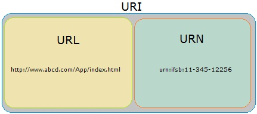

<!-- GFM-TOC -->
* [一 、基础概念](#一-基础概念)
    * [URL](#url)
    * [请求和响应报文](#请求和响应报文)
<!-- GFM-TOC -->
# 一 、基础概念

## URL

URI 包含 URL 和 URN，目前 WEB 只有 URL 比较流行，所以见到的基本都是 URL。

- URI（Uniform Resource Identifier，统一资源标识符）
- URL（Uniform Resource Locator，统一资源定位符）
- URN（Uniform Resource Name，统一资源名称）

  
 

## 请求和响应报文

### 1. 请求报文

  
 

### 2. 响应报文

  
 
