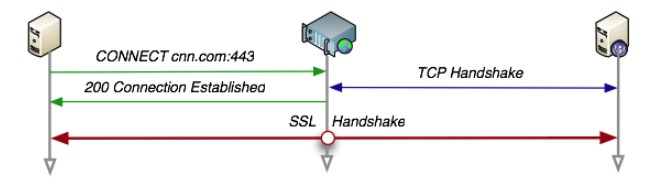

<!-- GFM-TOC -->
* [二、HTTP 方法](#二http-方法)
    * [GET](#get)
    * [HEAD](#head)
    * [POST](#post)
    * [PUT](#put)
    * [PATCH](#patch)
    * [DELETE](#delete)
    * [OPTIONS](#options)
    * [CONNECT](#connect)
    * [TRACE](#trace)
<!-- GFM-TOC -->

# 二、HTTP 方法

客户端发送的  **请求报文**  第一行为请求行，包含了方法字段。

## GET

> 获取资源

当前网络请求中，绝大部分使用的是 GET 方法。

## HEAD

> 获取报文首部

和 GET 方法一样，但是不返回报文实体主体部分。

主要用于确认 URL 的有效性以及资源更新的日期时间等。

## POST

> 传输实体主体

POST 主要用来传输数据，而 GET 主要用来获取资源。

更多 POST 与 GET 的比较请见第九章。

## PUT

> 上传文件

由于自身不带验证机制，任何人都可以上传文件，因此存在安全性问题，一般不使用该方法。

```html
PUT /new.html HTTP/1.1
Host: example.com
Content-type: text/html
Content-length: 16

<p>New File</p>
```

## PATCH

> 对资源进行部分修改

PUT 也可以用于修改资源，但是只能完全替代原始资源，PATCH 允许部分修改。

```html
PATCH /file.txt HTTP/1.1
Host: www.example.com
Content-Type: application/example
If-Match: "e0023aa4e"
Content-Length: 100

[description of changes]
```

## DELETE

> 删除文件

与 PUT 功能相反，并且同样不带验证机制。

```html
DELETE /file.html HTTP/1.1
```

## OPTIONS

> 查询支持的方法

查询指定的 URL 能够支持的方法。

会返回 Allow: GET, POST, HEAD, OPTIONS 这样的内容。

## CONNECT

> 要求在与代理服务器通信时建立隧道

使用 SSL（Secure Sockets Layer，安全套接层）和 TLS（Transport Layer Security，传输层安全）协议把通信内容加密后经网络隧道传输。

```html
CONNECT www.example.com:443 HTTP/1.1
```

<div align="center">  </div><br>

## TRACE

> 追踪路径

服务器会将通信路径返回给客户端。

发送请求时，在 Max-Forwards 首部字段中填入数值，每经过一个服务器就会减 1，当数值为 0 时就停止传输。

通常不会使用 TRACE，并且它容易受到 XST 攻击（Cross-Site Tracing，跨站追踪）。
