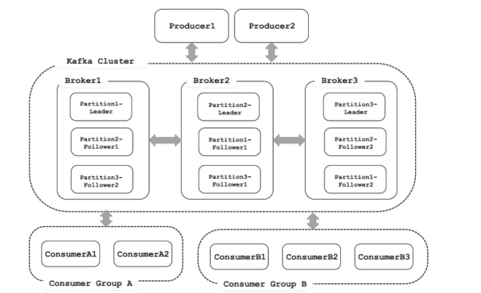
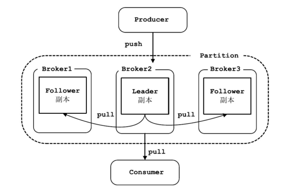
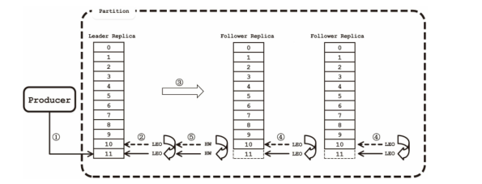

# Kafka原理分析

## 介绍

Apache Kafka是一个分布式发布-订阅消息传递系统，最初由LinkedIn公司开发，后于2010年贡献给Apache 基金会并成为顶级开源项目。它是一个分布式的、可划分的、冗余备份的持久性的日志服务，主要用于处理活跃的流式数据。其架构如下图所示：

    

Kafka的工作流程大致如下：

生产者会根据业务逻辑产生消息，之后根据路由规则将消息发送到指定分区的Leader副本所在的Broker上。在Kafka服务端接收到消息后，会将消息追加到Log中保存，之后Follower副本会与Leader副本进行同步，当ISR集合中所有副本都完成了此消息的同步后，则Leader副本的HW会增加，并向生产者返回响应。

当消费者加入到Consumer Group时，会触发Rebalance操作将分区分配给不同的消费者消费。随后，消
费者会恢复其消费位置，并向Kafka服务端发送拉取消息的请求，Leader副本会验证请求的offset以及其他相
关信息，最后返回消息。

## Kafka的一些概念

### Message

消息是Kafka中最基本的数据单元。消息由一串字节构成，其中主要由key和value构成，key和value也都是byte数组；

### Broker

Kafka 集群包含一个或多个服务器，这种服务器被称为 Broker；

### Topic

主题，Kafka根据topic对消息进行归类，发布到Kafka集群的每条消息都需要指定一个topic；

### Partition

物理上的概念，每个 Topic 包含一个或多个 Partition，每个Partition内部是有序的；

每个消息在被添加到分区时，都会被分配一个offset，它是消息在此分区中的唯一编号，Kafka通过offset保证消息在分区内的顺序，offset的顺序性不跨分区，即Kafka只保证在同一个分区内的消息是有序的；同一Topic的多个分区内的消息，Kafka并不保证其顺序性。

### 副本

Kafka对消息进行了冗余备份，每个Partition可以有多个副本，每个副本中包含的消息是一样的。每个分区的副本集合中，都会选举出一个副本作为Leader副本，Kafka在不同的场景下会采用不同的选举策略。所有的读写请求都由选举出的Leader副本处理，其他都作为Follower副本，Follower副本仅仅是从Leader 副本处把数据拉取（pull）到本地之后，同步更新到自己的Log中。一般情况下，同一分区的多个分区会被分配到不同的Broker上，这样，当Leader所在的Broker宕机之后，可以重新选举新的Leader，继续对外提供服务。

如下图所示：

    

### ISR集合

ISR（In-Sync Replica）集合表示的是目前“可用”（alive）且消息量与Leader相差不多的副本集合，这是整个副本集合的一个子集。“可用”和“相差不多”都是很模糊的描述，其实际含义是ISR集合中的副本必须满足下面两个条件：

1. 副本所在节点必须维持着与ZooKeeper的连接；
2. 副本最后一条消息的offset与Leader副本的最后一条消息的offset之间的差值不能超出指定的阈值。

每个分区中的Leader副本都会维护此分区的ISR集合。写请求首先由Leader副本处理，之后Follower副本会从Leader上拉取写入的消息，这个过程会有一定的延迟，导致Follower副本中保存的消息略少于Leader副本，**只要未超出阈值都是可以容忍的**。如果一个Follower副本出现异常，比如：宕机，发生长时间GC而导致Kafka僵死或是网络断开连接导致长时间没有拉取消息进行同步，就会违反上面的两个条件，从而被Leader副本踢出ISR集合。当Follower副本从异常中恢复之后，会继续与Leader副本进行同步，当Follower副本“追上”（即最后一条消息的offset的差值小于指定阈值）Leader副本的时候，此Follower副本会被Leader副本重新加入到ISR中。

### HW

HW（HighWatermark）标记了一个特殊的offset，当消费者处理消息的时候，只能拉取到HW之前的消息，HW之后的消息对消费者来说是不可见的。与ISR集合类似，HW也是由Leader副本管理的。当ISR集合中全部的Follower副本都拉取HW指定消息进行同步后，Leader副本会递增HW的值。Kafka官方网站将HW之前的消息的状态称为“commit”，其含义是这些消息在多个副本中同时存在，即使此时Leader副本损坏，也不会出现数据丢失。

### LEO

LEO（Log End Offset）是所有的副本都会有的一个offset标记，它指向追加到当前副本的最后一个消息的offset。当生产者向Leader副本追加消息的时候，Leader副本的LEO标记会递增；当Follower副本成功从Leader副本拉取消息并更新到本地的时候，Follower副本的LEO就会增加。下图展示了针对offset为11的消息，ISR集合、HW与LEO是如何协调工作的：

    

①Producer向此Partition推送消息。
②Leader副本将消息追加到Log中，并递增其LEO。
③Follower副本从Leader副本拉取消息进行同步。
④Follower副本将拉取到的消息更新到本地Log中，并递增其LEO。
⑤当ISR集合中所有副本都完成了对offset=11的消息的同步，Leader副本会递增HW。

在①~⑤步完成之后，offset=11的消息就对生产者可见了。

Kafka**权衡了同步复制和异步复制两种策略**，通过引入了ISR集合，巧妙地解决了上面两种复制策略存在的缺陷：

- 当Follower副本的延迟过高时，Leader副本被踢出ISR集合，消息依然可以快速提交，生产者可以快速得到响应，避免高延时的Follower副本影响整个Kafka集群的性能。
- 当Leader副本所在的Broker突然宕机的时候，会优先将ISR集合中Follower副本选举为Leader副本，新的Leader副本中包含了HW之前的全部消息，这就避免了消息的丢失。值得注意是，Follower副本可以批量地从Leader副本复制消息，这就加快了网络I/O，Follower 副本在更新消息时是批量写磁盘，加速了磁盘的I/O，极大减少了Follower与Leader的差距。

### Producer

消息生产者，向Broker发送消息的客户端；生产者（Producer）的主要工作是生产消息，并将消息按照一定的规则推送（push）到Topic的分区中。这里选择分区的“规则”可以有很多种，例如：根据消息的key的Hash值选择分区，或按序轮询（Round-robin）全部分区的方式。

### Consumer

消息消费者，从Broker读取消息的客户端；消费者（Consumer）的主要工作是从Topic中拉取消息，并对消息进行消费。某个消费者消费到Partition的哪个位置（offset）的相关信息，是Consumer自己维护的。

这样设计非常巧妙，**避免了Kafka Server端维护消费者消费位置的开销**，尤其是在消费数量较多的情况下。另一方面，如果是由Kafka Server端管理每个Consumer消费状态，一旦Kafka Server端出现延时或是消费状态丢失，将会影响大量的Consumer。同时，这一设计也提高了Consumer的灵活性，Consumer可以按照自己需要的顺序和模式拉取消息进行消费。例如：Consumer可以通过修改其消费的位置实现针对某些特殊key的消息进行反复消费，或是跳过某些消息的需求。

### Consumer Group

在Kafka中，多个Consumer可以组成一个Consumer  Group，一个Consumer只能属于一个Consumer Group。Consumer Group保证其订阅的Topic的每个分区只被分配给此Consumer Group中的一个消费者处理。如果不同Consumer Group订阅了同一Topic，Consumer Group彼此之间不会干扰。这样，如果要实现一个消息可以被多个消费者同时消费（“广播”）的效果，则将每个消费者放入单独的一个Consumer  Group；如果要实现一个消息只被一个消费者消费（“独占”）的效果，则将所有的Consumer放入一个Consumer  Group中。

> 注意，Consumer  Group中消费者的数量并不是越多越好，当其中消费者数量超过分区的数量时，会导
> 致有消费者分配不到分区，从而造成消费者的浪费。

## 特性

- **高吞吐量、低延迟**：Kafka每秒可以处理几十万条消息，而它的延迟最低只有几毫秒；
- **可拓展性**：Kafka集群支持热拓展；
- **持久性、可靠性**：消息被持久化到本地磁盘，并且支持数据备份防止数据丢失；
- **容错性**：允许集群中节点失败（若副本数量为n,则允许n-1个节点失败）；
- **高并发**：支持数千个客户端同时读写

## 参考资料

- [《Apache Kafka源码剖析》](https://www.amazon.cn/dp/B072HQC5KB)